<p align="center">
  
</p>

<p align="center">
  <a href="https://github.com/ishandutta2007/Awesome-Awesome-Awesome"></a>
  <a href="https://discord.gg/jc4xtF58Ve"></a>
  <a href="https://github.com/ishandutta2007/Awesome-Admissions-CRM/stargazers"></a>
  <a href="https://github.com/ishandutta2007/Awesome-Admissions-CRM/forks"></a>
  <a href="https://github.com/ishandutta2007/Awesome-Admissions-CRM/blob/main/LICENSE"></a>
  <a href="https://github.com/ishandutta2007/Awesome-Admissions-CRM/pulls"></a>
  <a href="https://github.com/ishandutta2007"></a>
</p>

---

# 🎓 Awesome Admissions CRM &amp; Student Enrollment Systems

> **A curated directory of top SaaS platforms and open-source GitHub projects for Higher Education &amp; K-12 Admissions CRM, Student Recruitment, Inquiry Management, Application Review Funnels, and Enrollment Pipelines.** 🚀

**Admissions Customer Relationship Management (CRM)** and **Enrollment Management Systems (EMS)** empower higher-education institutions, universities, private K-12 academies, and school districts to streamline prospective student discovery, automate lead nurturing campaigns, evaluate applications collaboratively, and maximize yield.

---

## 📑 Table of Contents
- [🎯 Overview &amp; Key Features](#-overview--key-features)
- [🏢 SaaS &amp; Commercial Hosted Platforms](#-saas--commercial-hosted-platforms)
- [⭐ Open-Source GitHub Projects](#-open-source-github-projects)
- [🏗️ Architectural Frameworks for Custom Pipelines](#️-architectural-frameworks-for-custom-pipelines)
- [🔍 SEO &amp; Comparison Keywords](#-seo--comparison-keywords)
- [🤝 How to Contribute](#-how-to-contribute)
- [⚖️ Disclaimer &amp; Privacy Compliance](#️-disclaimer--privacy-compliance)
- [📈 Star History](#-star-history)

---

## 🎯 Overview &amp; Key Features

Modern Admissions CRMs manage the entire student lifecycle journey:
- 📥 **Inquiry &amp; Lead Capture**: Landing pages, multi-step application forms, campus visit / tour scheduling, and chatbot intake.
- ⚡ **Omnichannel Communication**: Automated email drip campaigns, two-way SMS, WhatsApp messaging, and counselor calling queues.
- 📂 **Application &amp; Document Review**: PDF reader portals, transcript parsing, faculty evaluation rubrics, recommendation letters, and scholarship scoring.
- 📊 **Enrollment Funnel Analytics**: Real-time yield predictions, conversion tracking by demographic/cohort, financial aid matching, and deposit verification.
- 🔒 **Data Compliance**: FERPA, GDPR, SOC 2, and student record confidentiality standards.

---

## 🏢 SaaS &amp; Commercial Hosted Platforms

*Commercial admissions CRM platforms sorted in descending order by parent organization size (Annual Revenue / Valuation).*

| 🏛️ Platform | 💼 Company Size (Revenue / Valuation) | 📝 Description | 💵 Starting Pricing | 🎁 Free Tier / Trial Limits |
| :--- | :--- | :--- | :--- | :--- |
| **[TargetX (Salesforce)](https://www.targetx.com/)** | **~$35B+ Revenue / ~$280B Market Cap** *(Salesforce Parent)* | Enterprise higher-education CRM built natively on Salesforce; provides recruitment, admissions, inquiry management, and student lifecycle success. | ~$30,000 / year *(or ~$500 / month base for small teams + Salesforce core licensing)* | No free tier or trial *(Salesforce-partner guided interactive demo environment on request)* |
| **[Blackbaud Enrollment Management](https://www.blackbaud.com/)** | **~$1.1B Revenue / ~$4.2B Valuation** *(NASDAQ: BLKB)* | Enterprise admissions, financial aid, and enrollment suite for independent K-12 schools and universities within the connected Blackbaud cloud. | ~$8,000 / year *(annual contract tiered by total student enrollment)* | No free tier or self-serve trial *(Guided live product demonstration and workflow preview on request)* |
| **[Finalsite Enrollment](https://www.finalsite.com/)** | **~$150M+ ARR / ~$1.5B Valuation** *(Bridgepoint Backed)* | Dedicated K-12 admissions and enrollment CRM solution supporting inquiry-to-matriculation funnels, contracts, and family portals. | ~$6,000 / year *(annual base package for independent school admissions)* | No free tier or trial *(Custom 1-on-1 discovery demo and module evaluation on request)* |
| **[SchoolAdmin](https://www.schooladmin.com/)** | **~$150M+ ARR / ~$1.5B Valuation** *(Finalsite Parent)* | Tailored admissions and enrollment CRM for private and independent schools; features inquiry tracking, event booking, and digital contract signing. | ~$5,000 – $7,500 / year *(scaled by active student enrollment volume and modules)* | No free tier or trial *(Live guided walkthrough demo with admissions specialists on request)* |
| **[Veracross Admissions](https://www.veracross.com/)** | **~$100M+ ARR / ~$800M+ Valuation** *(Leeds Equity Backed)* | Seamless admissions and enrollment module within the unified 100% web-based Veracross School Information System (SIS). | ~$6,000 / year *(~$500 / month base module fee for independent schools)* | No free tier or trial *(Guided personalized sandbox demo on request)* |
| **[Slate by Technolutions](https://technolutions.com/)** | **~$50M – $100M ARR / ~$500M+ Valuation** *(Technolutions)* | The gold-standard higher-education admissions CRM in North America; deep customizable application reading, event travel management, and query engines. | $30,000 / year *(< 1,500 submitted applications/yr; unlimited user seats)* | No free tier or self-serve trial *(Start.edu student discovery portal is free; customized demo on request)* |
| **[SchoolMint](https://www.schoolmint.com/)** | **~$60M+ ARR / ~$350M Valuation** *(BV Investment Backed)* | Strategic enrollment management, lottery allocation, and registration CRM platform for public school districts and charter networks. | ~$2.00 / student / year *(~$5,000 / year minimum institutional platform base fee)* | No free tier or trial *(Live district/charter admissions sandbox walkthrough on request)* |
| **[OpenApply](https://www.openapply.com/)** | **~$40M – $60M ARR / ~$250M Valuation** *(Faria Education Group)* | Paperless online admissions and enrollment platform widely used by over 600 international and private schools across 80+ countries. | ~$3,000 / year *(annual subscription tiered by school size and feature set)* | No free tier or trial for schools *(Public interactive demo sandbox account; 100% free for applicants &amp; parents)* |
| **[Element451](https://element451.com/)** | **~$15M – $25M ARR / ~$80M Valuation** *(Element451)* | Modern AI-first higher-ed admissions CRM and engagement platform with generative conversational AI bots, behavioral marketing, and decisioning. | ~$20,000 / year *(base institutional recruitment &amp; admissions package)* | No free tier or self-serve trial *(Interactive live sandbox demo available upon consultation)* |
| **[Classe365 CRM](https://www.classe365.com/)** | **~$5M – $10M ARR / ~$30M Valuation** *(Classe365)* | Cloud-based Education CRM and Student Information System (SIS) with student applicant tracking, web forms, invoice billing, and analytics. | $50 / month *(or $2 / student / month for base tier up to 100 students)* | 15-day free trial *(Full access to all CRM, SIS, and admissions modules; no credit card required)* |

---

## ⭐ Open-Source GitHub Projects

*High-impact open-source CRM, Student Information Systems (SIS), form builders, and engagement engines suitable for building self-hosted admissions workflows. Sorted descending by GitHub stargazers count.*

| 📦 Project | 🌟 GitHub Stars | 💻 Tech Stack | 📖 Admissions &amp; Recruitment Capabilities |
| :--- | :--- | :--- | :--- |
| **[Twenty](https://github.com/twentyhq/twenty)** | [](https://github.com/twentyhq/twenty/stargazers) | TypeScript, React, NestJS, PostgreSQL | Modern open-source CRM alternative to Salesforce; custom recruiting objects, visual kanban applicant pipelines, GraphQL APIs, and custom task workflows. |
| **[Odoo Community](https://github.com/odoo/odoo)** | [](https://github.com/odoo/odoo/stargazers) | Python, JavaScript, PostgreSQL | Modular ERP &amp; CRM suite; customizable Education modules, applicant stage tracking, automated email triggers, and custom registration web portals. |
| **[Cal.com](https://github.com/calcom/cal.com)** | [](https://github.com/calcom/cal.com/stargazers) | TypeScript, Next.js, Prisma, Tailwind | Self-hosted scheduling infrastructure used by universities for campus visits, admissions interview slots, counselor office hours, and routing forms. |
| **[ERPNext / Frappe Education](https://github.com/frappe/erpnext)** | [](https://github.com/frappe/erpnext/stargazers) | Python, Frappe Framework, MariaDB | Complete open-source ERP with built-in Education module; manages student applicant records, admissions review programs, fee schedules, and guardian portals. |
| **[Chatwoot](https://github.com/chatwoot/chatwoot)** | [](https://github.com/chatwoot/chatwoot/stargazers) | Ruby on Rails, Vue.js, PostgreSQL | Omnichannel live messaging and customer communication platform for admissions counselors (Live Chat, WhatsApp, SMS, Email, and Instagram DMs). |
| **[Formbricks](https://github.com/formbricks/formbricks)** | [](https://github.com/formbricks/formbricks/stargazers) | TypeScript, Next.js, Tailwind, Prisma | Privacy-focused open-source survey and form engine for prospective student inquiries, application intake, parent feedback, and admissions evaluations. |
| **[Moodle LMS](https://github.com/moodle/moodle)** | [](https://github.com/moodle/moodle/stargazers) | PHP, MariaDB / MySQL, PostgreSQL | World's leading learning platform; includes student registration modules, course self-enrolment plugins, identity verification, and orientation pathways. |
| **[Relaticle](https://github.com/Relaticle/relaticle)** | [](https://github.com/Relaticle/relaticle/stargazers) | Go, Vue.js, SQLite / PostgreSQL | Next-generation lightweight AI-augmented CRM; provides recruitment contact timelines, customizable pipeline stages, and multi-team isolation. |
| **[Gibbon SIS](https://github.com/GibbonEdu/core)** | [](https://github.com/GibbonEdu/core/stargazers) | PHP, MySQL | Flexible open-source school platform tailored for international and independent schools; native online application forms, admissions trackers, and student dossiers. |
| **[openSIS Classic](https://github.com/os4ed/opensis-classic)** | [](https://github.com/os4ed/opensis-classic/stargazers) | PHP, PostgreSQL / MySQL | Open-source Student Information System (SIS) with student enrollment tracking, demographic data collection, transcripts, and parent access portals. |
| **[Next.js Enrollment &amp; Student Systems](https://github.com/e2e2a/nextjs-enrollment)** | [](https://github.com/e2e2a/nextjs-enrollment/stargazers) | TypeScript, Next.js, Prisma, SQLite | Clean open-source school enrollment management starter featuring applicant tracking, course registration, document status checklists, and admin views. |
| **[KoAkademy](https://github.com/yukazakiri/koakademy)** | [](https://github.com/yukazakiri/koakademy/stargazers) | PHP, Laravel, React, MySQL | Modern open-source academic management system with configurable student enrollment workflows, applicant registration forms, tuition billing, and custom branding. |
| **[Advising App (Canyon GBS)](https://github.com/canyongbs/advisingapp)** | [](https://github.com/canyongbs/advisingapp/stargazers) | Python, AI Frameworks | Open-source AI-assisted student recruitment and academic advising CRM with conversational engagement tracking, student profiles, and counselor notes. |
| **[Multi-center Admission Management](https://github.com/ambristech/admission-management-system-multi-center-open-source)** | [](https://github.com/ambristech/admission-management-system-multi-center-open-source/stargazers) | PHP, MySQL | Open-source admission management software designed for multi-branch colleges, student registration, document storage, and course seat allocations. |

---

## 🏗️ Architectural Frameworks for Custom Pipelines

For engineering teams looking to build an institutional-grade, self-hosted Admissions CRM stack:

```
┌────────────────────────────────────────────────────────────────────────┐
│                   Prospective Student Touchpoints                      │
│      (Web Inquiries, Virtual Tours, High School Visits, Ads)           │
└──────────────────────────────────┬─────────────────────────────────────┘
                                   │
                                   ▼
┌────────────────────────────────────────────────────────────────────────┐
│                Inquiry Capture & Lead Scheduling Layer                 │
│         • Formbricks / Cal.com / Chatwoot Omnichannel Bots             │
└──────────────────────────────────┬─────────────────────────────────────┘
                                   │
                                   ▼
┌────────────────────────────────────────────────────────────────────────┐
│             Admissions CRM & Relationship Management Engine            │
│         • Twenty CRM / ERPNext Frappe / Relaticle Pipeline             │
│         (Applicant scoring, automated email drip, counselor tasks)     │
└──────────────────────────────────┬─────────────────────────────────────┘
                                   │
                                   ▼
┌────────────────────────────────────────────────────────────────────────┐
│                 Core Student Information System (SIS)                  │
│         • Gibbon SIS / openSIS / Custom Institutional ERP              │
│         (Enrolled student records, billing, transcripts, compliance)   │
└────────────────────────────────────────────────────────────────────────┘
```

- **Inquiry &amp; Tour Booking**: Deploy **Formbricks** alongside **Cal.com** for self-serve tour scheduling and prospective inquiry intake.
- **Counselor Communication**: Integrate **Chatwoot** for multi-channel messaging across WhatsApp, SMS, and website live chat.
- **Pipeline &amp; Application Review**: Use **Twenty CRM** or **ERPNext** to manage stages (`Prospect` → `Inquiry` → `Applicant` → `Admitted` → `Deposited` → `Enrolled`).
- **Data Warehousing &amp; Funnel Analytics**: Pipe CRM events into **Metabase** or **Apache Superset** for yield forecasting.

---

## 🔍 SEO &amp; Comparison Keywords

*This curated repository indexes software and tools related to the following domains:*

`Admissions CRM` • `Higher Education CRM` • `Student Enrollment Management System (EMS)` • `K-12 Admissions Software` • `Slate by Technolutions Alternative` • `Element451 Alternative` • `TargetX Salesforce Education Cloud` • `Open-Source SIS` • `Open-Source Education CRM` • `Student Recruitment Platform` • `Applicant Tracking System for Schools` • `Enrollment Funnel Analytics` • `FERPA Compliant Student CRM` • `University Prospect Management` • `School Tour Scheduling Engine` • `Paperless School Admissions`

---

## 🤝 How to Contribute

Contributions are warmly encouraged! Help keep this curated directory up-to-date:

1. 🍴 **Fork** this repository.
2. 🌿 **Create a branch**: `git checkout -b add-admissions-crm-tool`
3. 📝 **Edit `README.md`**: Follow the existing tabular structure, including verified starting pricing, free tier / trial terms, and GitHub star badges.
4. 🚀 **Commit &amp; Push**: `git commit -m "Add [Tool Name] to Admissions CRM directory"`
5. 📬 **Submit a Pull Request** with a brief summary of the software.

*Check out more awesome lists at [Awesome-Awesome-Awesome](https://github.com/ishandutta2007/Awesome-Awesome-Awesome).*

---

## ⚖️ Disclaimer &amp; Privacy Compliance

- This repository is a community-curated directory for informational and educational purposes.
- Mentions of commercial brands, trademarks, and logos belong to their respective copyright holders.
- Educational institutions handling applicant and minor records must perform independent security reviews to ensure strict compliance with **FERPA (US)**, **GDPR (EU)**, **COPPA**, and relevant institutional data privacy standards.

---

## 📈 Star History

[](https://star-history.dera.page/#ishandutta2007/Awesome-Admissions-CRM&type=date&legend=top-left)

---

<p align="center">
  <sub>Built with ❤️ for admissions deans, enrollment managers, registrars, and EdTech developers worldwide.</sub>
</p>
